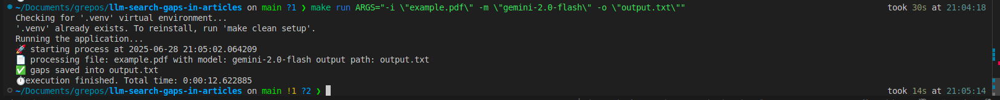

# **LLM search gaps in articles**

<p align="center"> 🚀 This script is designed to search gaps in pdf articles using LLMs </p>

Execution Example



<h3>🏁 Table of Contents</h3>

<br>

===================

<!--ts-->

💻 [Dependencies and Environment](#dependenciesandenvironment)

☕ [Using](#using)

👷 [Author](#author)

<!--te-->

===================

<div id="dependenciesandenvironment"></div>

## 💻 **Dependencies and Environment**

Dependencies and versions

- Python 3.10.12

**Gemini**: This project uses the paid Google Gemini API, it's necessary to configure a valid Gemini API Key. Ensure you have a `.env` file with the environment variable **API_KEY**.

**Deepseek, local processing**: The project can use the Deepseek model for local processing, which requires the installation and configuration of [Ollama](https://ollama.com/download)

<div id="using"></div>

## ☕ **Using**

First, check the [dependencies](#dependenciesandenvironment) process

Feel free to change the prompt as you see fit in [`prompt.txt`](./prompt.txt)

You also can create scripts to exec N models for N inputs and generate N output files, like in [`exec_many.sh`](./exec_many.sh)

You can clean the environment using

```
$ make clean
```

Check files format with

```
$ make lint
```

Format files with

```
$ make format
```

Exec unit tests with

```
$ make test
```

to exec:

```
$ make run ARGS="-i \"INPUT PATH\""
```

Below are the arguments that can be used when running the script, with a brief explanation of each:

- `-m`, `--model`: Set the model (default: **gemini-2.5-flash-preview-05-20**).
- `-o`, `--output`: Output path (default: **gaps.txt**).

Example executing with all arguments:

```
$ make run ARGS="-i \"INPUT PATH\" -m \"gemini-2.0-flash\" -o \"output.txt\""
```

<div id="author"></div>

#### **👷 Author**

Made by Glener Pizzolato! 🙋

[](https://www.linkedin.com/in/glener-pizzolato-6319821b0/)
[](mailto:glenerpizzolato@gmail.com)
